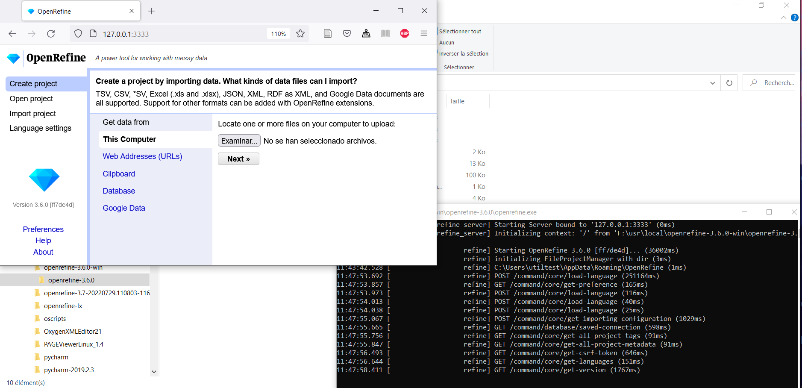

<html><!--
 Stuff to add that was not in chapter
 - that only one class (poem) is not enough and then we need to make the search sensitive to verse as well
 - can point to errors in the storni extraction and say how that should be solved
 --></html>

Extracción de contenido a partir de fuentes HTML con OpenRefine
========

- [Introducción](#intro)
- [Instalación](#instalacion)
- [Arrancar OpenRefine](#arrancar)
- [Extracción de un poema dado su URL](#extraccion-poema-indiv)
  - [Iniciar el proyecto](#iniciar-proyecto)
  - [Bajar el HTML](#bajar-html)
  - [Extracción de la información](#extraccion-infos)
    - [Extracción de los metadatos del poema](#extraccion-metadatos)
    - [Extracción del texto del poema](#extraccion-texto)

# Introducción

La extracción de contenido o *scraping* con OpenRefine, partiendo de fuentes HTML (o de los URLs que llevan a ellas) se ha descrito en las secciones 4.1 y 4.2 del capítulo.


El marcado HTML y sus características relevantes para la extracción se presentaron en la sección 2.2. del capítulo.

Comenzamos aquí directamente con las manipulaciones a efectuar en OpenRefine.

<a name="instalacion"></a>

# Instalación

OpenRefine se puede descargar desde https://openrefine.org/download.html

Las instrucciones de instalación están en https://docs.openrefine.org/manual/installing

OpenRefine es multiplataforma (Windows, Linux, Mac). Requiere el entorno Java, pero si no está instalado y no se quiere instalar aparte, la página de descargas proporciona un instalador que incluye el entorno.

En el momento de la preparación de este tutorial, la versión utilizada para OpenRefine es la 3.6, de enero de 2022, en [Windows](https://oss.sonatype.org/service/local/artifact/maven/content?r=releases&g=org.openrefine&a=openrefine&v=3.6.0&c=win&p=zip) (versión sin Java incluído, ya que estaba instalado antes) y [Linux](https://oss.sonatype.org/service/local/artifact/maven/content?r=releases&g=org.openrefine&a=openrefine&v=3.6.0&c=linux&p=tar.gz).

<a name="arrancar"></a>

# Arrancar OpenRefine

En Windows, desde el directorio donde se ha descomoprimido el .zip descargado, se puede ejecutar `openrefine.exe` o `refine.bat`.

|  | 
|:--:| 
|  | 
| Figura 1. Arrancar OpenRefine (en Windows) |

Esto abre una consola (línea de comandos) y después la aplicación OpenRefine en el navegador por defecto, en la dirección http://127.0.0.1:3333

Si la aplicación no se abre en el navegador por defecto, se puede copiar esa misma dirección en otro navegador. Aquí hemos usado Firefox en Windows, y Firefox o Chrome en Linux.

<a name="extraccion-poema-indiv"></a>

# Extracción de un poema dado su URL

<a name="iniciar-proyecto"></a>

## Iniciar el proyecto

Para comenzar una extracción, hay varias posibilidades, que se ven en las opciones del menú *Create project*, que se ve en la figura 1 abajo. Entre otras, las siguientes:
- utilizar archivos que ya están en el ordenador
- Dar URLs
- Pegar el contenido del portapapeles (hemos copiado información antes con *Ctrl+C* y la pegamos aquí)

Aquí vamos a pegar los URLs que nos interesan y bajaremos el HTML de las páginas a las que corresponden.

Como ejemplo de extracción de un poema individual, tomamos “Una viñeta” de Delmira Agustini: https://es.wikisource.org/wiki/Una_vi%C3%B1eta .

Como muestra la figura 2, se pega el URL (1) y después de confirmar con *Next*, podemos crear el proyecto (2). El nombre de proyecto elegido aquí es *AgustiniPoemaIndiv*.

Para que OpenRefine analize el URL correctamente, hay que elegir la opción *Parse data as Line-based text files*. Así tomará el valor de la línea completa como el URL (sin intentar dividirlo).

Se confirma la creación del proyecto con *Create project*.

|1|
|:--:|
|  | 
|**2**| 
||
| Figura 2. Copiar URL de portapapeles (1) e iniciar un proyecto (2) |

El proyecto tiene inicialmente una sola columna (*Column 1*) que contiene el URL que hemos introducido (figura 3).

<a name="bajar-html"></a>

### Bajar el HTML

|  | 
|:--:|
|Figura 3. Única columna inicial del proyecto|

La figura 4 muestra el diálogo para bajar el HTML de la página asociada al URL.

En (1), con la opción *Edit column*, disponible en el menú desplegable que se activa con la flecha de *Column 1*, se selecciona *Add columns by fetching URL)

En el diálogo de (2), hay varias partes que nos interesan:

- *New column name*: para el nombre de la nueva columna; aquí hemos elegido *htmlOriginal* 
- *Throttle delay*: el  numero de milisegundos (ms) que OpenRefine va a esperar entre peticiones de páginas al servidor. Por defecto espera 5 segundos, pero podemos cambiar este valor a algo más corto, p. ej. 1200 ms.
- On error: Hay dos opciones, *set to blank* y *store error*. *Store error* es más interesante en el sentido de que, en caso de que la operación dé un error, el mensaje de error se almacenará en la celda correspondiente de la columna. Al contrario esa celda quedará blanca.

Las opciones relacionadas con la manipulación de resultados (cuadro *Expression* y paneles *Preview*, *History*) se ven más abajo.

Aquí dejamos, dentro del cuadro *Expression*, la expresión `value`. El resultado de bajar el HTML de la página asociada el URL será almacenado en la columa *htmlOriginal* (ver figura 5) sin manipulación ulterior. 


<a name="fig-5"></a>
|1|
|:--:|
|  | 
|**2**|
|  | 
|Figura 4. Bajar el HTML para el URL|

|  | 
|:--:|
|Figura 5. Nueva columna *htmlOriginal*|

<a name="extraccion-infos"></a>

## Extracción de la información

A partir de este HTML, vamos a extraer metadatos del poema (autora y título), así como su texto.

Las partes siguientes del HTML nos interesan para esto (figura 6):

<a name="fig-6"></a>
**(1) Autora**
```xml
<span class="ws-author">Delmira Agustini</span>
```

**(2) Título**
```xml
<title>Una viñeta - Wikisource</title>
```

**(3) Texto del poema**
```xml
<div class="poem">
<p>&#160;Tarde sucia de invierno. El caserío,   <br />
&#160;como si fuera un croquis al creyón,   <br />
&#160;se hunde en la noche. El humo de un bohío,   <br />
&#160;que sube en forma de tirabuzón;   <br />
&#160;<br />
<br />
&#160;mancha el paisaje que produce frío,  <br />
&#160;y debajo de la genuflexión   <br />
&#160;de la arboleda, somormuja el río   <br />
&#160;su canción, su somnífera canción.   <br />
&#160;<br />
<br />
&#160;Los labradores, camellón abajo,   <br />
&#160;retornan fatigosos del trabajo,  <br />
&#160;como un problema sin definición.   <br />
&#160;<br />
<br />
&#160;Y el dueño del terruño, indiferente,   <br />
&#160;rápidamente, muy rápidamente,   <br />
&#160;baja en su coche por el camellón.
</p>
</div>
```
Figura 6. Elementos HTML a partir de los cuales extraeremos la información

Para extraer información, usaremos expresiones del lenguaje [GREL](https://docs.openrefine.org/manual/grel) (*General Refine Extraction Language*) usado por OpenRefine para extraer información.

Se accede al diálogo de extracción con la opción *Edit column / Add column based on this column* del menú desplegable (flecha) de cada columna (figura 7.1). 

El diálogo de extracción (figura 7.2) tiene los componentes siguientes.

- *New column name*: **(a)** en la imagen. Para introducir el nombre de la columna que será creada con el valor de la extracción
- *On error*: La opción "store error" es útil ya que, en caso de error, escribe en la columna el tipo de error
- *Expression*: **(b)** en la imagen. Expresión GREL para hacer la extracción
- *Preview*: Panel de previsualización.
    - La columna izquierda **(c)** muestra el contenido de la columna actual.
    - La columna derecha **(d)** muestra el resultado de aplicar la expresión en el cuadro (b) al contenido de la columna en (c). Esto es una previsualización que nos permite probar nuestras expresiones antes de lanzar la creación de una nueva columna con ellas.

|7.1|
|:--:|
|  | 
|**7.2**|
|  | 
|Figura 7. Diálogo principal de extracción en OpenRefine|


<a name="extraccion-metadatos"></a>

### Extracción de los metadatos

Para extraer la autora, damos la expresión GREL completa a continuación (expresión 1), pero explicamos después sus partes:

<a name="exp-1"></a>
**Expresión 1**
```
value.parseHtml().select("span[class=ws-author]")[0].innerHtml()
```

- **`value`**: Se refiere al contenido de cada celda de la columna. Es una variable definida por OpenRefine
- **`parseHtml()`**: Como se dijo en el capítulo, los documentos HTML son una estructura arbórea. Este árbol se puede expresar mediante una cadena de caracteres que sigue ciertas reglas de sintaxis. Con `parseHtml()`, el parseador (analizador) de OpenRefine crea un árbol HTML a partir de la cadena de texto que lo represente
- **`select()`**: Esta instrucción permite seleccionar conjuntos de nodos dentro del árbol HTML. Se le da como argumento (es decir, la cadena entrecomillada que va entre los paréntesis) una expresión que describe estos nodos, según la sintaxis descrita en la [documentación](https://jsoup.org/apidocs/org/jsoup/select/Selector.html). Es una sintaxis similar a la que se usa en el lenguaje [CSS](https://uniwebsidad.com/libros/css/capitulo-2/selectores-basicos) para describir conjuntos de elementos.
    - **`span[class=ws-author]`**: Selecciona el conjunto de elementos `<span>` que llevan un atributo `class` cuyo valor es *ws-author*, lo cual corresponde al elemento que contiene la autora, ver [figura 6](#fig-6) (1)
- **`[0]`**: ¿Por qué añadir esto después de `select()`? Se debe a que `select()` devuelve sus resultados dentro de una **lista** (llamada *array*). Incluso cuando hay un sólo elemento que corresponde a la descripción (como es el caso aquí), este se incluye dentro de una estructura de datos de tipo lista. Para acceder a este primer elemento, se hace con `[0]` (empezamos a contar los miembros de la lista por 0). Después de aplicar `[0]` al resultado de `select()`, tenemos ya un elemento HTML como resultado, al que podemos aplicar los métodos (funciones) disponibles para este tipo de objeto. 
- **`innerHtml()`**: Dado un elemento HTML, la instrucción `innerHtml()` devuelve el marcado que corresponde al contenido de un elemento. En este caso, el único contenido es texto (no hay otras etiquetas), con lo que podemos aplicar esta instrucción para extraer el texto. Otra instrucción, que extrae texto exclusivamente, es `ownText()`. En caso de que haya elementos anidados, hay otras instrucciones de GREL como `htmlText()` para extraer el texto (ver [documentación](https://docs.openrefine.org/manual/grel))

Se recomienda al amable público probar las diferentes partes de la expresión final en la ventana de expresiones (figura 7.2, (b)) para verificar el resultado de cada una.

El resultado de una de las expresiones `value.parseHtml().select("span[class=ws-author]")` ya se mostró en la figura 7.2. Esto sirve para destacar que `select()` devuelve una lista (entre corchetes), aunque la lista tenga en este caso un único elemento.

La figura 8 muestra el resultado de la expresión final.

|  | 
|:--:|
|Figura 8. Expresión para extracción de la autora a una columna *autora*|

Para extraer el título, si observamos varios poemas, veremos que el elemento más fiable para extraerlo es el elemento `<title>` de la página. Este elemento se usa para dar un título a la ventana o pestaña del navegador.  
 
Damos la expresión GREL completa a continuación (expresión 1), pero explicamos después el contenido de esta que no se ha visto ya:

<a name="exp-2"></a>
**Expresión 2**
```
value.parseHtml().select("title")[0].innerHtml().replace(" - Wikisource", "")
```

La novedad aquí es que, para elminiar la cadena  <em> - Wikisource</em> y dejar solo el título, aplicamos `replace()` al resultado de `select()`. Esta instrucción toma como primer argumento la secuencia a reemplazar y como segundo argumento la cadena por la cual debe ser sustituida. Como la segunda cadena está vacía `""`, el resultado es la eliminación de la cadena que se ha dado como primer argumento.

|  | 
|:--:|
|Figura 8. Expresión para extracción del título a una columna *título*|

<a name="extraccion-texto"></a>

### Extracción del texto del poema

Pasamos a la extracción del texto del poema.

Antes de dar la expresión que efectúa la extracción en una sola etapa, damos una expresión que corresponde a una etapa intermedia, para destacar algunas de las operaciones a efectuar.

<a name="exp-3"></a>
**Expresión 3**
```
value.parseHtml().select("div[class=poem]")[0].select("p")[0].innerHtml().unescape("html").split("<br>")
```

|  | 
|:--:|
|Figura 10. Estado intermedio en extracción del texto del poema. Se muestra para destacar que `split()` devuelve una lista como resultado.|

La expresión 3 extrae una lista (*array*) con el texto de cada verso del poema. Vemos en esta expresión una nueva instrucción, **`split()`**, que toma `<br>` como argumento  (el argumento es la secuencia entrecomillada dentro de los paréntesis).

El array de resultado de la expresión 3 (ver figura 10) está compuesto de cadenas de texto, una por verso, que se muestran entre comillas y separadas por comas. Hay también cadenas que solo contienen un espacio entre las comillas; corresponden a la separación entre estrofas. A partir de este *array*, vamos a extraer el poema como una única cadena de texto, manteniendo la separación de estrofas, con la expresión 4.

La expresión completa para extraer el texto del poema es la expresión 4. Explicaremos después de la expresión las partes de esta que no se han visto todavía.

|  | 
|:--:|
|Figura 11. Expresión final para extraer el texto del poema|

<a nae="exp-4"></a>
**Expresión 4**
```
forEach(value.parseHtml().select("div[class=poem]")[0].select("p")[0].innerHtml().unescape("html").split("<br>"), verso, verso.trim()).join("\n")
```

El funcionamiento de esta expresión se explicó en detalle en el capítulo. La información se reproduce aquí para facilitar su consultación. 

- **`unescape("html")`**: sustituye las entidades HTML por el carácter que representan, en este caso sustituye &nsbp; por un espacio indivisible.
- **`forEach(secuencia, nombreVariable, expresión)`**: Existe un constructo *for each* en muchos lenguajes informáticos, para iterar sobre una secuencia y manipular el contenido de sus miembros. Este tipo de estructura se conoce como bucle (*loop*). En el lenguaje utilizado en OpenRefine (GREL), la instrucción `forEach` toma tres argumentos: una secuencia (una lista o *array*), un nombre de variable que sirve para recorrer los miembros de la secuencia (es decir, un iterador) y una expresión que típicamente mencionará a este iterador, para efectuar una operación sobre el contenido asignado a él. En el ejemplo, la secuencia es el *array* que contiene las cadenas que corresponden a los versos, ya visto en la figura 8, con la diferencia de que ahora las entidades HTML están reemplazadas por los caracteres que representan. El iterador, la variable para recorrer la secuencia, es la variable *verso* (si bien se puede usar cualquier otro nombre). El bucle `forEach` asigna iterativamente a la variable verso cada miembro del array (el contenido de cada verso en este caso), desde el primer hasta el último elemento del *array*.
- **`trim()`**: Con cada verso, dentro del bucle se efectúa esta operación, que retira espacios en blanco, si los hay, del inicio y fin de una cadena de texto. En este caso sí que  los hay, como se ve en la Figura 8, y `trim()` los eliminará.
- **`join("\n")`**: Esta función toma un array de cadenas de texto como entrada, y las une usando la secuencia de caracteres (delimitador) que se le da como argumento (entrecomillada dentro del paréntesis). La secuencia elegida aquí es `\n`, que representa un salto de línea. Por eso, el resultado que será almacenado en la columna *textoPoema* es el texto del poema. Las separaciones de estrofas se deben a las cadenas dentro del array que sólo contienen espacios. Al aplicar `trim()`, estos espacios desaparecen, pero queda en el array una cadena vacía o de longitud 0 caracteres. Al aplicar `join("\n")`, un salto de línea adicional se inserta, que crea la división de estrofas. Cabe mencionar también que las celdas de OpenRefine no pueden almacenar arrays, con lo que para almacenar el resultado de una operación hay que usar bien `.toString()` como instrucción final, bien `.join()` con un delimitador adecuado. El delimitador puede ser una cadena vacía, como en `.join("")`; esto une las cadenas inmediatamente una tras la otra. Si intentamos guardar un array (sin `join`) y hemos activado la opción store error (como en las figuras de este capítulo), OpenRefine mostrará en la columna un mensaje de error que nos advierte del problema. Para guardar cada miembro del array en líneas separadas (siempre dentro de la misma celda OpenRefine), el delimitador es `\n`.

|  | 
|:--:|
|Figura 11. Expresión final para extraer el texto del poema|

Como resumen, la tabla siguiente muestra las expresiones usadas para extraer la autora, el título y el texto del poema, cada uno en su columna

<table>
<caption style="caption-side: bottom">Table 1. Resumen de las expresiones GREL utilizadas</caption>
<thead>
  <tr>
    <th>Columna de entrada</th>
    <th>Columna creada</th>
    <th>Expresión de OpenRefine</th>
  </tr>
</thead>
<tbody>
  <tr>
    <td style="font-family:monospace">htmlOriginal</td>
    <td style="font-family:monospace">autora</td>
    <td style="font-family:monospace">value.parseHtml().select("span[class=ws-author]")[0].innerHtml()</td>
  </tr>
  <tr>
    <td style="font-family:monospace">htmlOriginal</td>
    <td style="font-family:monospace">titulo</td>
    <td style="font-family:monospace">value.parseHtml().select("title")[0].innerHtml().replace(" - Wikisource", "")</td>
  </tr>
  <tr>
    <td style="font-family:monospace">htmlOriginal</td>
    <td style="font-family:monospace">textoPoema</td>
    <td style="font-family:monospace">forEach(value.parseHtml().select("div[class=poem]")[0].select("p")[0].innerHtml().unescape("html").split("<br>"), verso, verso.trim()).join("\n")</td>
  </tr>
</tbody>
</table>

# Extracción de múltiples poemas a partir de una lista de URLs

%TODO

