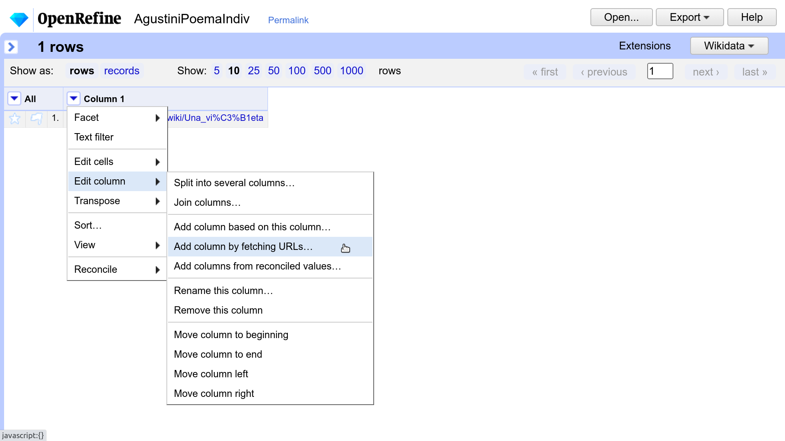

<html><!--
 Stuff to add that was not in chapter
 - that only one class (poem) is not enough and then we need to make the search sensitive to verse as well
 - can point to errors in the storni extraction and say how that should be solved
 --></html>

# Extracción de contenido a partir de fuentes HTML con OpenRefine

La extracción de contenido o *scraping* con OpenRefine, partiendo de fuentes HTML (o de los URLs que llevan a ellas) se ha descrito en las secciones 4.1 y 4.2 del capítulo.

El marcado HTML y sus características relevantes para la extracción se presentaron en la sección 2.2. del capítulo.

Comenzamos aquí directamente con las manipulaciones a efectuar en OpenRefine.

## Instalación

OpenRefine se puede descargar desde https://openrefine.org/download.html

Las instrucciones de instalación están en https://docs.openrefine.org/manual/installing

OpenRefine es multiplataforma (Windows, Linux, Mac). Requiere el entorno Java, pero si no está instalado y no se quiere instalar aparte, la página de descargas proporciona un instalador que incluye el entorno.

En el momento de la preparación de este tutorial, la versión utilizada para OpenRefine es la 3.6, de enero de 2022, en [Windows](https://oss.sonatype.org/service/local/artifact/maven/content?r=releases&g=org.openrefine&a=openrefine&v=3.6.0&c=win&p=zip) (versión sin Java incluído, ya que estaba instalado antes) y [Linux](https://oss.sonatype.org/service/local/artifact/maven/content?r=releases&g=org.openrefine&a=openrefine&v=3.6.0&c=linux&p=tar.gz).

## Arrancar OpenRefine

En Windows, desde el directorio donde se ha descomoprimido el .zip descargado, se puede ejecutar `openrefine.exe` o `refine.bat`.

|  | 
|:--:| 
|  | 
| Figura 1. Arrancar OpenRefine (en Windows) |

Esto abre una consola (línea de comandos) y después la aplicación OpenRefine en el navegador por defecto, en la dirección http://127.0.0.1:3333

Si la aplicación no se abre en el navegador por defecto, se puede copiar esa misma dirección en otro navegador. Aquí hemos usado Firefox en Windows, y Firefox o Chrome en Linux.

## Extracción de un poema dado su URL

Para comenzar una extracción, hay varias posibilidades, que se ven en las opciones del menú *Create project*, que se ve en la figura 1 abajo. Entre otras, las siguientes:
- utilizar archivos que ya están en el ordenador
- Dar URLs
- Pegar el contenido del portapapeles (hemos copiado información antes con *Ctrl+C* y la pegamos aquí)

Aquí vamos a pegar los URLs que nos interesan y bajaremos el HTML de las páginas a las que corresponden.

## Extracción de múltiples poemas a partir de una lista de URLs

Para el poema individual, tomamos “Una viñeta” de Delmira Agustini: https://es.wikisource.org/wiki/Una_vi%C3%B1eta .

Como muestra la figura 2, se pega el URL (1) y después de confirmar con *Next*, podemos crear el proyecto (2). El nombre de proyecto elegido aquí es *AgustiniPoemaIndiv*.

Para que OpenRefine analize el URL correctamente, hay que elegir la opción *Parse data as Line-based text files*. Así tomará el valor de la línea completa como el URL (sin intentar dividirlo).

Se confirma la creación del proyecto con *Create project*.

|1|
|:--:|
|  | 
|**2**| 
||
| Figura 2. Copiar URL de portapapeles (1) e iniciar un proyecto (2) |

El proyecto tiene inicialmente una sola columna (*Column 1*) que contiene el URL que hemos introducido (figura 3).

|  | 
|:--:|
|Figura 3. Única columna inicial del proyecto|

|  | 
|:--:|
|Figura 3. Única columna inicial del proyecto|

|  | 
|:--:|
|Figura 3. Única columna inicial del proyecto|