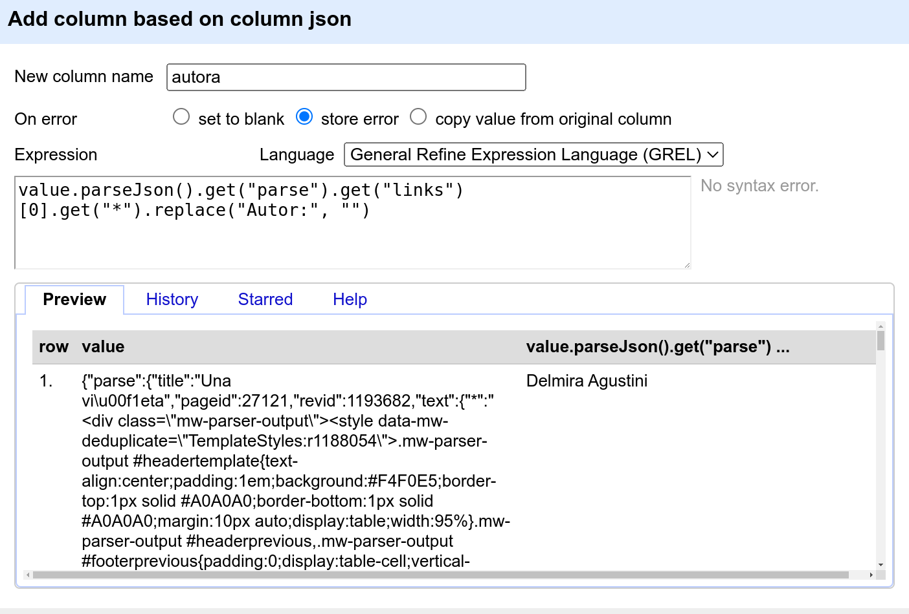
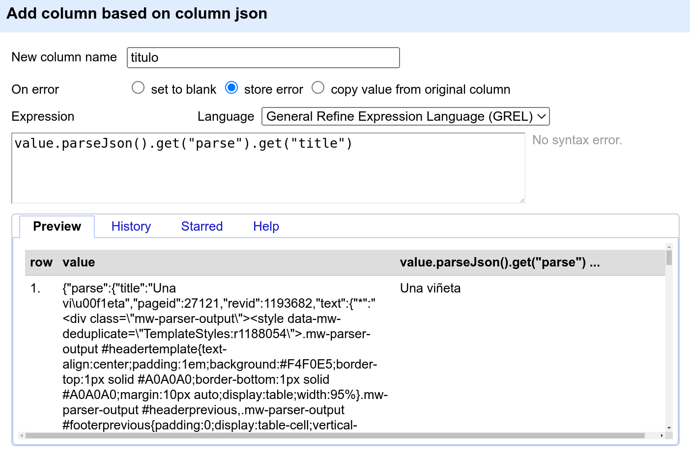
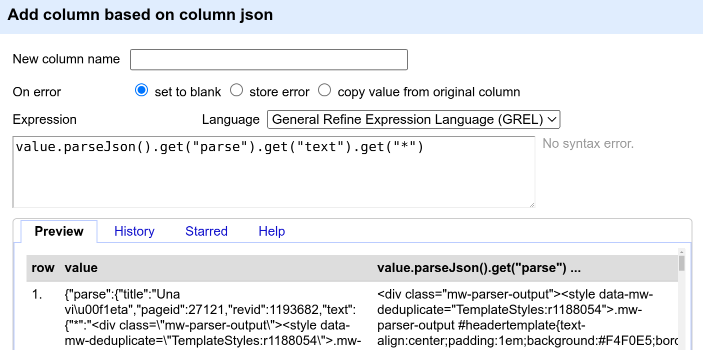
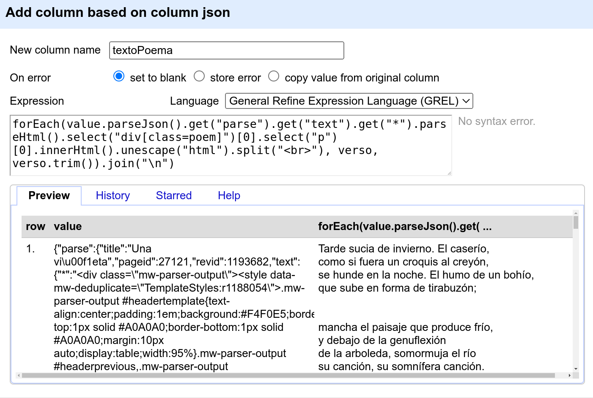
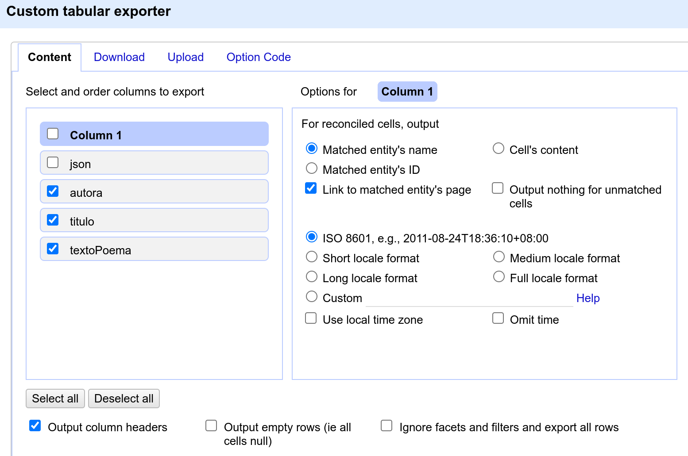
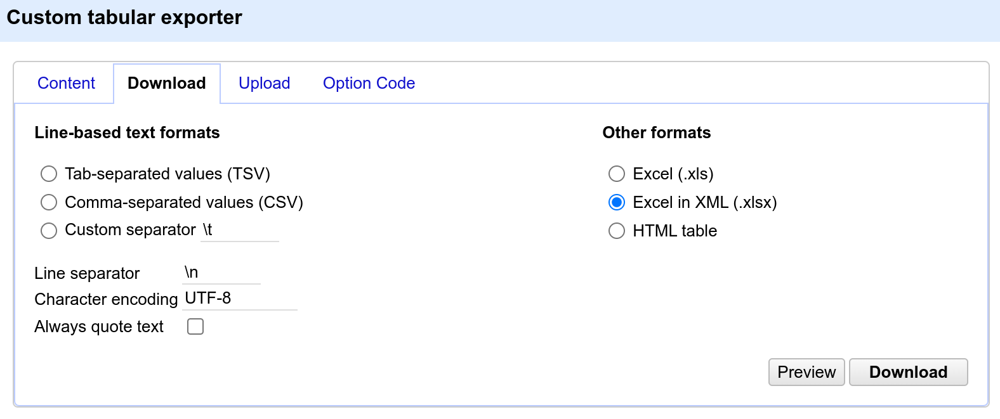

# Extracción de contenido en JSON con OpenRefine

- [Introducción: JSON](#s-intro)
  - [Sintaxis de JSON](#ss-sintaxis)
- [Extracción con OpenRefine](#s-manipular-xml)
- [Exportar la información extraída](#s-guardar)

<a name="s-intro"></a>

# Introducción: JSON

Como se vio en el capítulo, JSON (acrónimo de *JavaScript Object Notation*, y que podemos pronunciar como *jotasón*) es un lenguaje para representar contenido de forma estructurada. El formalismo para representar JSON mediante una cadena de texto identifica el contenido con pares anidables de clave-valor, en vez de con pares de etiquetas anidables, contrariamente al formalismo de los formatos HTML y XML.

Los datos en JSON, como pasa con los datos en XML, son datos ya estructurados: Hay identificadores (claves en JSON, etiquetas en XML) asociados a diferentes tipos de contenido, y podemos procesar el contenido en función de los identificadores. Cuando hacemos *scraping*, típicamente pasamos de contenido no estructurado (p. ej en HTML o en texto plano) a contenido estructurado. No obstante, puede haber contenido en JSON como parte de los contenidos web que manipulamos con el *scraping*, con lo cual se menciona el formato aquí. 

OpenRefine tiene algunas funciones para manipular JSON, que abordamos aquí. 

<a name="ss-sintaxis"></a>

## Sintaxis de JSON

En JSON la información se estructura con pares de clave-valor.

En el ejemplo, vemos claves como *poema*, *texto* y otras.

Hay varios tipos de valores posibles, los que vemos en el ejemplo son:

- cadenas de caracteres: P. ej. el valor asociado a la clave *nombre* dentro de *autoria*
- objetos: Los valores que se dan entre llaves `{}`. P. ej. los valores asociados a la clave *metadatos* y a la clave *autoria* son objetos
- listas: Aparecen entre `[]`. El valor para la clave *versos* es una lista, cuyos miembros son las cadenas de texto de cada verso

En JSON también puede haber valores numéricos y booleanos (verdaero, falso), así como un valor nulo.

Ya que las comillas forman parte de la sintaxis (tanto las claves como los valores de tipo cadena van entre comillas), si queremos usar comillas dentro de un valor, irán escapadas con barra inversa `\`, p. ej. el título del poema es *frigo y "frigo"*, que en JSON es `"frigo & \"frigo\""`

<a name="frag-ejemplo-json"></a>

**Ejemplo de documento expresado en JSON**
<html><span style="font-size:small">Elaboración propia</span></html>

```json
{
  "poema": {
    "metadatos": {
      "autoria": {
        "nombre": "Guillermo Carlos",
        "apellido": "Guillermos"
      },
      "titulo": "frigo & \"frigo\"",
      "fecha": ""
    },
    "texto": {
      "titulo": "frigo & \"frigo\"",
      "estrofas": [
        {
          "estrofa": {
            "tipo": "haiku",
            "versos": [
              "come la fruta",
              "del refrigerador",
              "muy deliciosa"
            ]
          }
        }
      ]
    }
  }
}

```

<a name="s-manipular-xml"></a>

# Extracción con OpenRefine

Wikisource también puede ofrecer su contenido en JSON, a través de comandos de su API (Application Programming Interface o interfaz de programación de aplicaciones, es decir, conjunto de instrucciones para interaccionar con un programa a partir de otro programa).

Usaremos el URL que permite a la API de Wikisource devolver en JSON la página del poema ya visto en el capítulo, "Una viñeta" de Delmira Agustini. El URL es https://es.wikisource.org/w/api.php?action=parse&page=Una_vi%C3%B1eta&format=json.

Procedemos de la misma forma que para bajar una página en HTML. Vamos a crear un proyecto a partir del URL y bajar el contenido asociado a este URL (las etapas se describen en la sección 4.1 del capítulo).

Asumimos aquí que estas etapas ya se han efectuado, y que tenemos dentro de nuestro proyecto OpenRefine una columna llamada *json* que contiene el JSON a analizar.

A partir de esta columna, extraeremos la autora y título del poema, así como su texto. Si miramos el JSON de la columna, nos interesan los fragmentos siguientes:

**Para la autora**

```json
'links': [{'ns': 106, 'exists': '', '*': 'Autor:Delmira Agustini'}],
```

**Para el título**

```json
{'parse': {'title': 'Una viñeta', ...
```

**Para el texto**
```json
'text': {'*': '<div class="mw-parser-output"> ...
```

En los casos de la autora y título, se ve claramente la localización de la información. En el caso del texto del poema, la API de Wikisource no da un campo específico con su contenido. Lo que hace es dar, dentro del elemento `<text>`, una cadena de texto que expresa una parte del contenido principal del cuerpo de la página en HTML (la parte central con el poema y algunos de sus metadatos). Así que debemos extraer esta cadena, crear un árbol HTML y extraer el texto del poema a partir de este. No es el uso más típico de JSON pero nos permite combinar los conocimientos vistos en el capítulo.

<a name="sss-metadatos"></a>

Extraemos la autora con la expresión [GREL](https://docs.openrefine.org/manual/grelfunctions) siguiente:

```
value.parseJson().get("parse").get("links")[0].get("*").replace("Autor:", "")
```

|  | 
|:--:| 
| Extracción de la autora a una nueva columna *autora* |


Extraemos el título con la expresión [GREL](https://docs.openrefine.org/manual/grelfunctions) siguiente:

```
value.parseJson().get("parse").get("title")
```

|  | 
|:--:| 
| Extracción del título a una nueva columna *titulo* |

Nos ocupamos ahora del texto. Primero extraemos la parte central del cuerpo de la página Wikisource que contiene el poema con alguna información más (como se ha dicho, la API no divide el contenido de forma más detallada). Para esto usamos la expresión [GREL](https://docs.openrefine.org/manual/grelfunctions) siguiente (no creamos una columna todavía ya que esta expresión no nos da el resultado final)

```
value.parseJson().get("parse").get("text").get("*")
```

|  | 
|:--:| 
| Etapa intermedia para mostrar que la clave `["parse"]["text"]` tiene como valor una representación HTML del texto del poema entre otras informaciones |


<!-- %TODO explain .ownText() -->

Ya que esta cadena expresa el HTML de la página, la analizaremos con el parseador de HTML y extraeremos el texto del poema, usando las mismas operaciones que ya se vieron en el capítulo.

```
forEach(value.parseJson().get("parse").get("text").get("*").parseHtml().select("div[class=poem]")[0].select("p")[0].innerHtml().unescape("html").split("<br>"), verso, verso.trim()).join("\n")
```

|  | 
|:--:| 
| Extracción del texto del poema a una nueva columna *textoPoema* |

<a name="s-guardar"></a>

# Exportar la información extraída

OpenRefine tiene varias posibilidades de exportación de un proyecto, desde el botón *Export* arriba a la derecha. Por ejemplo la opción *Custom tabular exporter* que permite elegir las columnas a exportar. 

|1|
|:--:|
|  | 
|**2**| 
|  |
| Exportación de las columnas seleccionadas |

ù
<html>
<!--
0.Create project
1.Create column json at index 1 by fetching URLs based on column Column 1 using expression grel:value
2.Create new column titulo based on column json by filling 1 rows with grel:value.parseJson().get("parse").get("title")
3.Create new column autora2 based on column json by filling 1 rows with grel:value.parseJson().get("parse").get("links")[0].get("*").replace("Autor:", "")
4.Rename column autora2 to autora
5.Create new column textoPoema based on column json by filling 1 rows with grel:forEach(value.parseJson().get("parse").get("text").get("*").parseHtml().select("div[class=poem]")[0].select("p")[0].innerHtml().unescape("html").split("<br>"), verso, verso.trim()).join("\n")
-->
</html>
